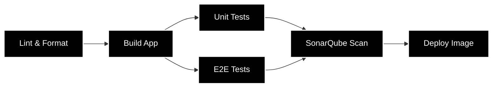

# 🚀 Python Enterprise CI/CD Pipeline Base

Este repositorio contiene una infraestructura base profesional de CI/CD diseñada para aplicaciones Python modernas. El sistema automatiza el ciclo de vida completo: desde la integración y validación de calidad hasta la entrega de una imagen lista para producción.

## 🔄 Pipeline Workflow

## 🔹 Integración Continua (CI)

El pipeline de CI garantiza la integridad del código mediante un flujo de validación:

- **✨ Linting y Análisis Estático**: Utiliza Ruff para asegurar la consistencia del estilo (PEP8) y detectar errores forma ultra-rápida.
- **📦 Build de Aplicación**: Se generan los binarios y se gestionan las dependencias de forma centralizada para acelerar los jobs subsecuentes.
- **🧪 Pruebas Unitarias e Integración**: Ejecución automatizada de los tests.
- **🌐 Pruebas End-to-End (E2E)**: Validación de flujos completos de usuario usando docker con cypress.
- **🛡️ Calidad y Seguridad (SAST)**: Integración con SonarQube para auditar la deuda técnica, vulnerabilidades y mantener los estándares del Quality Gate.

## 🔹 Despliegue Continuo (CD)

Capacidad de generación de artefactos inmutables y optimizados para entornos productivos:

- **🐳 Dockerization**: Construcción de imagen Docker listo para despliegue.
- **📂 Gestión de Artefactos**: Uso de GitHub Artifacts para el transporte seguro de paquetes (.whl) entre las etapas del pipeline.
- **⚡ Optimización de Cache**: Implementación de caching inteligente en la instalación de dependencias.

## 🔹 Seguridad y Observabilidad

- **🔑 Gestión de Secretos**: Uso estricto de GitHub Secrets para el manejo de credenciales y variables sensibles, evitando fugas de información.
- **📊 Dashboard de Resumen**: Al finalizar el proceso, se genera un reporte visual en el Step Summary de GitHub, permitiendo una auditoría rápida de cada fase del pipeline.

## 📖 Cómo usar este Pipeline

### 1. Configuración Inicial

Asegúrate de tener los siguientes secretos configurados en tu repositorio (Settings > Secrets and variables > Actions):

- `SONAR_TOKEN`: Token generado en tu instancia de SonarQube.
- `SONAR_HOST_URL`: URL de tu servidor SonarQube o SonarCloud.

### 2. Flujo de Desarrollo

1. **Crea una rama (feature branch)**: Desarrolla tus cambios y haz commit.
2. **Abre un Pull Request**: Al abrir un PR hacia main, el pipeline de CI se activará automáticamente ejecutando Lint, Tests y E2E.
3. **Revisa el Summary**: Entra a la ejecución del Action para ver el dashboard de resultados. Si algo falla, el merge estará bloqueado.

### 3. Despliegue

Una vez aprobado el pipeline, hara los tests de ci y en cd se generará la imagen Docker ya lista para despliegue.

> **Nota:** asegurate de formatear tu codigo con ruff para seguir las normas de estilo :)